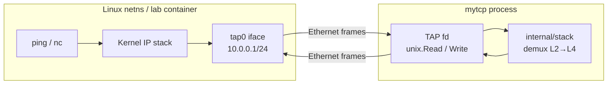
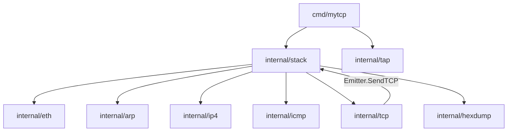
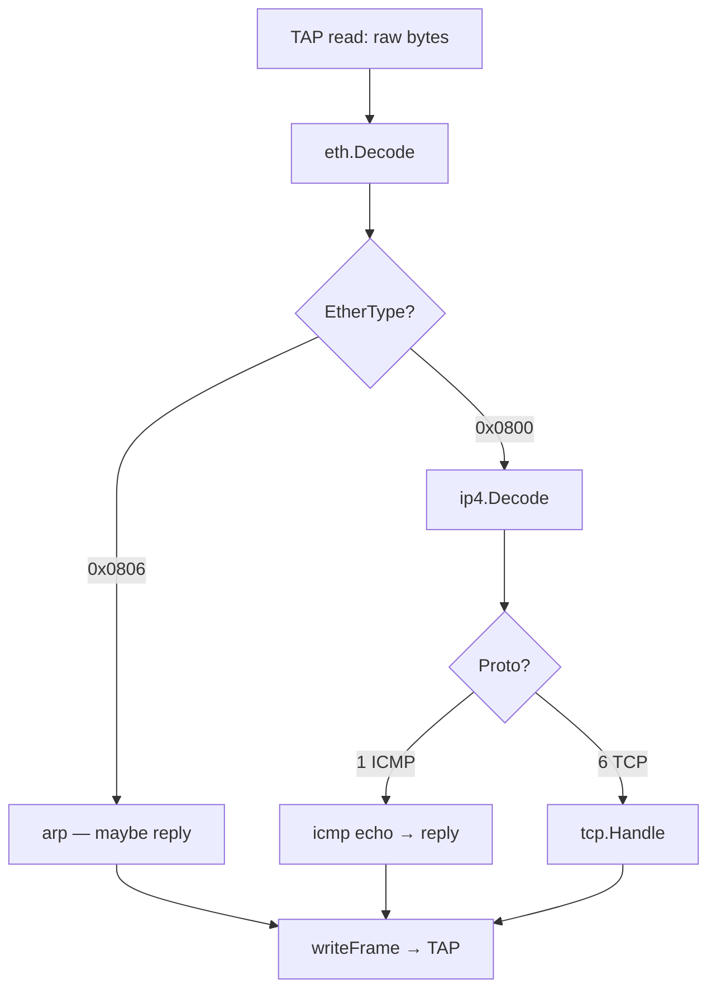
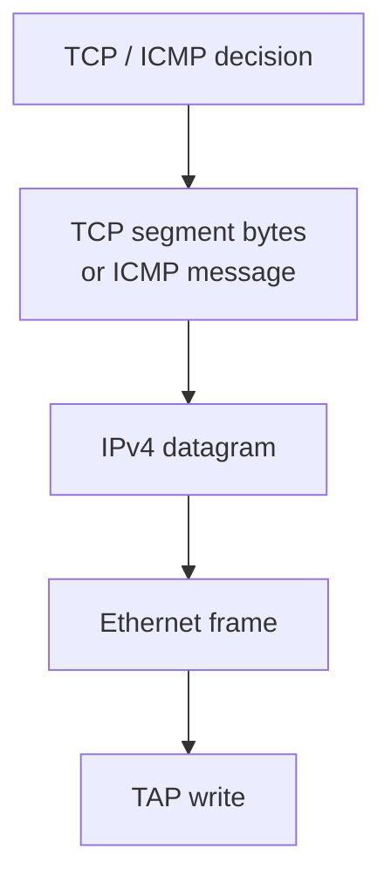
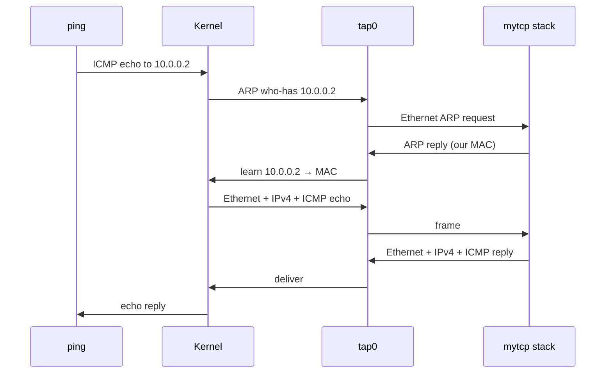
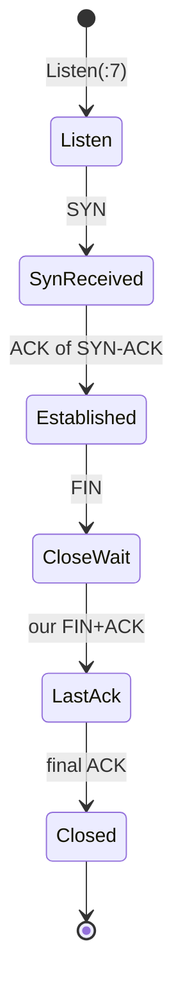
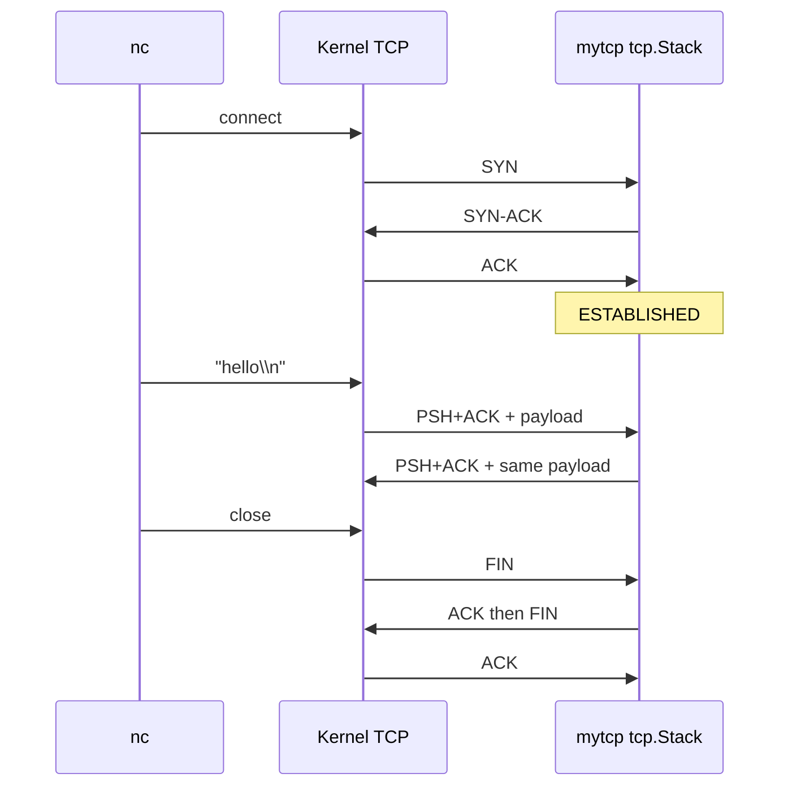
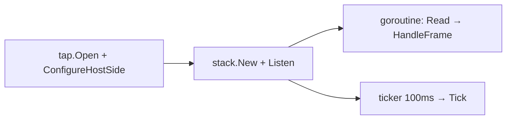
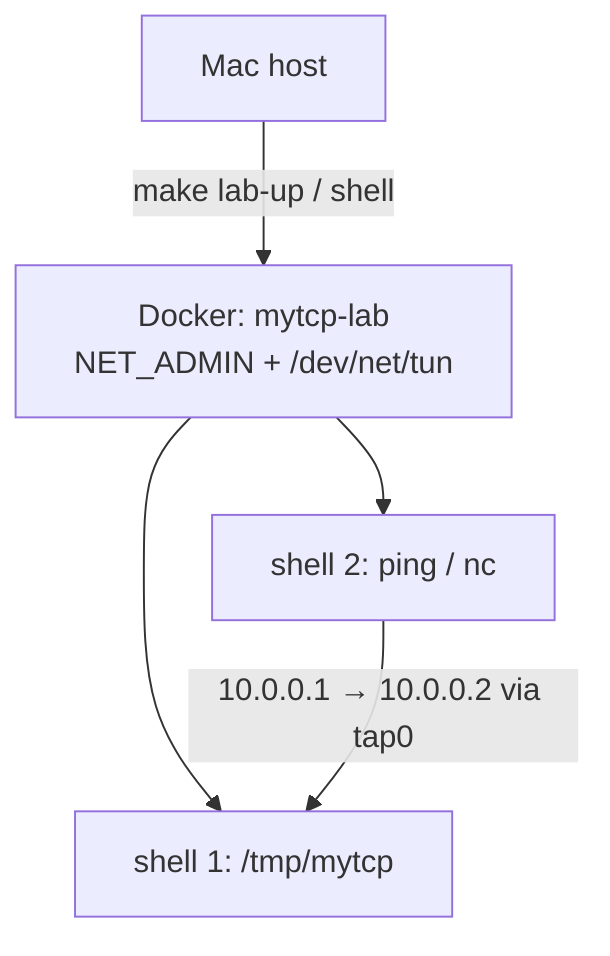

# mytcp architecture

How the userspace stack fits together — **bottom → top** (bytes upward) and
**top → bottom** (a ping / TCP echo downward).

**What is actually built (windows, retransmit, gaps):** see
[IMPLEMENTATION.md](IMPLEMENTATION.md) — start there if you are asking
“how much TCP is real?”.

Companion: [ROADMAP.md](ROADMAP.md) (growth stages), [README.md](README.md) (run).

---

## Big picture

On a normal machine, `ping` and `nc` talk to the **kernel** TCP/IP stack.
Here the kernel only owns one side of a virtual NIC (`tap0`). The other side
is a file descriptor our Go process reads and writes. **We** implement
Ethernet, ARP, IPv4, ICMP, and a minimal TCP.



Defaults: kernel side `10.0.0.1/24`, userspace claims `10.0.0.2` /
`02:00:00:00:00:02`, TCP echo on port `7`.

---

## Package map



| Package | Layer | Job |
|---------|-------|-----|
| `tap` | I/O | Open `/dev/net/tun` (`IFF_TAP\|IFF_NO_PI`), blocking read/write, bring link up + host CIDR |
| `eth` | L2 | Ethernet II header decode/encode |
| `arp` | L2.5 | Who-has / is-at for IPv4 over Ethernet |
| `ip4` | L3 | IPv4 header + Internet checksum |
| `icmp` | L3 | Echo request → echo reply |
| `tcp` | L4 | Segments, conn table, handshake, echo, retransmit |
| `stack` | glue | RX demux, TX encapsulate, owns our MAC/IP |
| `hexdump` | debug | Frame dumps when `-dump` |

---

## Bottom → top (what a frame becomes)

Start at the wire-shaped bytes on the TAP fd and climb the layers.

### L2 — Ethernet frame on the TAP

`IFF_NO_PI` means no kernel “packet info” prefix. Each `read` is:

```text
[dst MAC 6][src MAC 6][EtherType 2][payload …]
```

| EtherType | Next |
|-----------|------|
| `0x0806` | ARP |
| `0x0800` | IPv4 |

`stack.HandleFrame` decodes with `eth.Decode`, drops frames not for our MAC
(unless broadcast), then switches on type.

### L2.5 — ARP

Host asks “who-has `10.0.0.2`?” We reply “`02:00:00:00:00:02` is-at”.
Without this, the kernel never sends IPv4 to our MAC.

### L3 — IPv4

Header (20 bytes min): version/IHL, total length, TTL, protocol, src, dst,
checksum. Protocol `1` → ICMP, `6` → TCP. Dest must equal our IP or we ignore.

### L3/L4 — ICMP echo

Type 8 request → type 0 reply, same id/seq/payload. That is `ping`.

### L4 — TCP

Segment: ports, seq, ack, flags, window, checksum (pseudo-header + segment),
payload. `tcp.Stack` keys connections by `(remoteIP, remotePort, localPort)`.



---

## Top → bottom (how replies are built)

Outbound path is the reverse: application intent → headers wrapped outward →
bytes on the fd.

### ICMP reply path

1. `icmp.ReplyFrom` builds type-0 message + checksum  
2. `stack.sendIPv4` wraps IPv4 (src=us, dst=peer, proto=ICMP)  
3. Ethernet (dst=peer MAC from RX, src=our MAC, type=IPv4)  
4. `nif.Write`

### TCP send path

TCP never talks to TAP directly. It calls `Emitter.SendTCP` (implemented by
`stack.Stack`):

1. `tcp.Segment.Encode` — TCP header + payload + checksum  
2. `sendIPv4` — IP header  
3. `eth.Frame` — L2  
4. `writeFrame`



---

## End-to-end: `ping 10.0.0.2`



---

## End-to-end: `nc 10.0.0.2 7` (echo)

Minimal TCP we implement: passive open, one data path (echo), passive close,
retransmit of unacked segments.





**Reliability (Stage 5):** segments that consume seq space are queued as
outstanding. A 100ms tick retransmits after RTO (500ms), up to 5 tries.
Pure ACKs are not queued.

---

## Process loop (`cmd/mytcp`)



Why not `os.File.Read`? Go’s netpoller cannot epoll `/dev/net/tun` →
`not pollable`. We use blocking `unix.Read` / `unix.Write` on the fd.

---

## Lab topology



Same netns: both shells share `tap0`. The stack process is the peer host;
`ping`/`nc` are clients of the kernel address on that iface.

---

## What we deliberately do not own

See the full matrix in [IMPLEMENTATION.md](IMPLEMENTATION.md). Headline gaps:

- **No flow-control enforcement** — peer `Window` is stored, not applied on send  
- **No congestion window** — fixed RTO retransmit only  
- NIC drivers / interrupts / DMA (`myos` territory)  
- Full RFC TCP (SACK, window scale, RTT estimator, simultaneous open, …)  
- UDP, IPv6, fragmentation, routing beyond on-link TAP  
- Kernel socket API — that is what `../c/02_tcp_server.c` uses instead  

Mental model: **sockets hide these bytes; TAP forces you to speak them.**
The demo proves small ping/`nc` paths, not a complete TCP.
