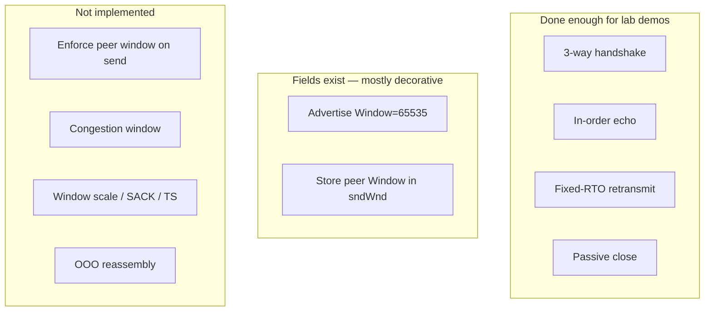
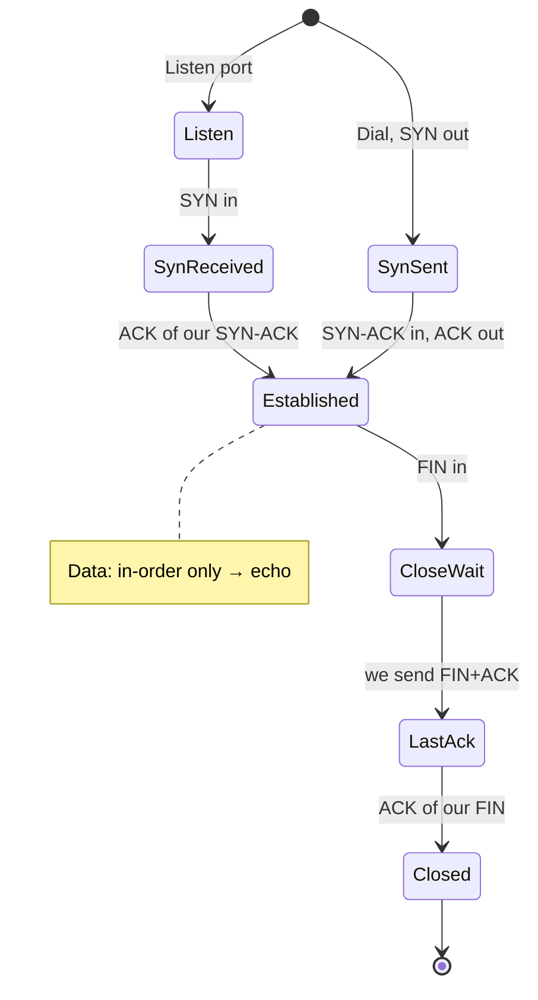

# What is actually implemented

This is the honest inventory: what works in demos, what fields exist but
are inert, and what is deliberately absent. If you wondered “is windowing
done?” — **short answer: the window *field* is filled in; flow-control and
congestion windowing are not.**

Architecture diagrams: [ARCHITECTURE.md](ARCHITECTURE.md).  
How we grew it: [ROADMAP.md](ROADMAP.md).

Legend: **yes** = exercised end-to-end · **partial** = present but incomplete
or not enforced · **no** = not built.

Each section keeps a summary table, then elaborates every row.

---

## Link / addressing

| Feature | Status | Notes |
|---------|--------|--------|
| Linux TAP (`IFF_TAP \| IFF_NO_PI`) | **yes** | Blocking `unix.Read/Write` (avoids Go “not pollable”) |
| Auto `ip link set up` + host CIDR | **yes** | Default host `10.0.0.1/24` via `-host` |
| Ethernet II decode/encode | **yes** | No 802.1Q, no LLC |
| Unicast + broadcast RX filter | **yes** | Drop frames not for our MAC (except broadcast) |
| ARP request → reply for our IP | **yes** | Enough for on-link ping/`nc` |
| ARP request + cache (for Dial) | **yes** | Learn from replies and requests about us; 3 tries 1 s apart; no expiry |
| Gratuitous ARP / probe | **no** | |
| macOS `utun` / `feth` backend | **no** | No stock TAP; lab is Linux/Docker |

**Linux TAP (`IFF_TAP | IFF_NO_PI`)** — Opens `/dev/net/tun` so each
`read`/`write` is a raw Ethernet frame (no kernel “packet info” header).
That is what lets us own L2 instead of starting at IP. Without TAP you
would only see what sockets expose. Example: `<<< RX 42 bytes` with
EtherType `08 06` is an ARP frame arriving on the fd.

**Auto `ip link set up` + host CIDR** — After open, we run `ip link set
… up` and `ip addr replace 10.0.0.1/24` on the kernel side of the TAP.
The kernel becomes a normal host on that /24; our process claims `.2`.
Without this, `tap0` stays DOWN, `ping` never emits frames, and the
stack looks “hung” with no logs. Override with `-host` or disable with
`-host=""`.

**Ethernet II decode/encode** — Split/join
`[dstMAC][srcMAC][EtherType][payload]`. Enables demux to ARP vs IPv4 and
correct TX encapsulation. We do not handle VLAN tags (`0x8100`) or
802.3/LLC frames — lab traffic from Linux is plain Ethernet II.

**Unicast + broadcast RX filter** — Accept frames whose dst MAC is ours
or `ff:ff:ff:ff:ff:ff`. Drops stray unicast meant for someone else (rare
on a point TAP, but correct). Broadcast is required so we see ARP
who-has.

**ARP request → reply for our IP** — When the kernel asks “who-has
10.0.0.2?”, we answer with our MAC. **Enables every IPv4 demo**: without
ARP, the host never learns where to send ICMP/TCP frames. Example: first
`ping` produces an ARP exchange in the dump, then ICMP.

**ARP request + cache (for Dial)** — Replies still go to the MAC the
request came from, but a connection we start has no frame to reply to.
`Stack.Resolve` picks the next hop (on-link, or the gateway), broadcasts
"who has 10.0.0.1? tell 10.0.0.2", and caches the answer
(`internal/stack/neigh.go`). Entries never expire.

**Gratuitous ARP / probe** — We do not announce ourselves unsolicited.
Fine on a quiet TAP; would matter on a shared L2 after MAC/IP changes.

**macOS `utun` / TUN / `feth` backend** — Not built. macOS has no stock TAP
(only L3 `utun`); `feth` can carry Ethernet frames but needs BPF + AF_NDRV,
not one TAP-style fd. We deliberately keep live I/O on the Linux Docker lab
so Stage 0 stays simple; decoders still unit-test on a Mac.

---

## IPv4 / ICMP

| Feature | Status | Notes |
|---------|--------|--------|
| IPv4 header decode/encode | **yes** | Options skipped on decode; we always emit IHL=5 |
| Header checksum (TX) | **yes** | |
| Header checksum verify (RX) | **no** | We trust the host path |
| ICMP echo request → reply | **yes** | `ping 10.0.0.2` |
| Other ICMP (dest unreach, etc.) | **no** | |
| UDP | **partial** | `BindUDP` / `WriteTo` / `ReadFrom`, enough for DNS; no ICMP port unreachable |
| DNS (stub resolver) | **yes** | A records only, over our UDP to `-dns` (1.1.1.1); no cache, no TCP fallback |
| IPv6 | **no** | Ignored when seen |
| Fragmentation / reassembly | **no** | Assumes whole datagrams |
| Routing / multiple ifaces | **partial** | One TAP; on-link subnet or one gateway (`-host`, `-gw`) |

**IPv4 header decode/encode** — Read version, lengths, TTL, protocol,
addresses; emit a minimal 20-byte header. Enables demux to ICMP vs TCP
and building replies that Linux accepts. Options in RX are skipped
(payload starts after IHL); we never emit options.

**Header checksum (TX)** — Internet checksum over the IP header so the
kernel does not drop our packets as corrupt. Visible in dumps as a
non-zero header checksum field that verifies to residual 0 when checked.

**Header checksum verify (RX)** — We do not reject bad checksums. On a
TAP from the local kernel this is almost always fine; on a lossy/buggy
path we might process garbage.

**ICMP echo request → reply** — Type 8 in → type 0 out, same id/seq/
payload. **Enables `ping 10.0.0.2`** as the first L3 proof the stack is
alive. Example: `ping -c 3 10.0.0.2` → three echo replies, stack logs
`icmp: echo request … — reply`.

**Other ICMP** — No destination-unreachable, time-exceeded, redirects.
A closed UDP port would not get a polite ICMP error from us; the
datagram is just dropped.

**UDP** — `internal/udp` encodes and decodes datagrams (pseudo-header
checksum, like TCP). The stack hands each one to the `UDPPort` bound to
its destination port, or drops it. It exists for DNS; there is no server
app on it.

**DNS (stub resolver)** — `stack.LookupIPv4` sends one A question
(`internal/dns`, hand-rolled: labels, compression pointers, CNAME chains
skipped) over our UDP to the `-dns` server, 3 tries 1 s apart, and
accepts only an answer from that server's port 53 with our random ID.
`DialContext` uses it, so `mytcp -get https://www.google.com/` makes no
kernel socket calls at all (`make smoke-internet` checks with strace).
No AAAA, no cache, no TCP fallback when an answer is truncated.

**IPv6** — Frames with EtherType IPv6 (or IPv6 inside dumps) are ignored.
Neighbor Discovery is not implemented; use IPv4 in the lab.

**Fragmentation / reassembly** — We assume each IP datagram arrives in
one Ethernet frame. Large packets that fragment will not be reassembled;
keep lab payloads small (ping/`nc` lines are fine).

**Routing / multiple ifaces** — One TAP, one /24, no forwarding table.
We only answer when `dst == our IP`. For connections we start, anything
off the `-host` subnet goes to one gateway (the kernel side by default);
in the lab, `scripts/lab-nat.sh` NATs it out to the internet.

---

## TCP — connection & data

| Feature | Status | Notes |
|---------|--------|--------|
| Passive open (`LISTEN`) | **yes** | `Stack.Listen(port)`; one port via `-tcp` |
| Active open (`connect`) | **yes** | `Stack.Dial` / `stack.DialContext`; `-dial`, `-get` |
| 3-way handshake | **yes** | SYN → SYN-ACK → ACK → ESTABLISHED |
| Simultaneous open | **no** | |
| Seq / ack numbering | **yes** | SYN/FIN consume one seq; data advances by length |
| In-order data receive | **yes** | Must match `rcv_nxt` exactly |
| Echo application | **yes** | Payload sent back with PSH+ACK |
| Out-of-order receive | **partial** | Duplicate ACK only; **no** reassembly queue / SACK |
| Passive close (peer FIN) | **yes** | ACK FIN, send FIN, wait final ACK |
| Active close (we FIN first) | **no** | App never closes first |
| TIME_WAIT | **no** | Jump to delete on final ACK |
| RST on bad / non-listen | **yes** | |
| Multiple concurrent conns | **yes** | Map keyed by remote IP+port + local port |
| PSH / ACK / SYN / FIN / RST flags | **yes** | URG not handled |
| TCP options (MSS, WScale, SACK, TS) | **no** | Decode skips option bytes; encode emits 20-byte header only |
| Checksum TX (pseudo-header) | **yes** | |
| Checksum verify RX | **no** | |

**Passive open (`LISTEN`)** — We wait for peers; `-tcp 7` registers port
7. **Enables `nc 10.0.0.2 7`** from the lab.

**Active open (`connect`)** — `Dial(ctx, ip, port)` resolves the next
hop's MAC, picks an ephemeral port (49152–65535), sends SYN (SYN_SENT),
and returns a `net.Conn` once SYN+ACK arrives and we ACK it. A RST is
`connection refused`; an unanswered SYN times out after the retransmit
limit. `stack.DialContext` has `net.Dialer`'s signature, so
`http.Transport{DialContext: st.DialContext}` makes Go's `http.Client`
ride on our TCP. No MSS option is sent, so peers fall back to 536-byte
segments.

**3-way handshake** — SYN in → SYN-ACK out → ACK in → ESTABLISHED.
**Enables a real Linux TCP client** to believe it has a connection.
Example log: `SYN → SYN_RECEIVED` then `ESTABLISHED`.

**Simultaneous open** — Both sides sending SYN at once is not modeled;
a bare SYN in SYN_SENT is ignored.

**Seq / ack numbering** — Track `rcv_nxt`, `snd_una`, `snd_nxt`. SYN and
FIN consume one sequence number; data consumes `len(payload)`. This is
the core of “TCP is a byte stream,” not message boundaries.

**In-order data receive** — Accept payload only if `seg.Seq == rcv_nxt`,
then advance `rcv_nxt`. **Enables correct echo** for normal in-order
Linux sends (the common case for interactive `nc`).

**Echo application** — Whatever bytes arrive (in order) are sent back
with PSH+ACK. That is the whole “app”: no HTTP, no framing. Example:
type `hello` in `nc` → see `hello` returned; stack logs
`recv … "hello\n"` and `send PSH,ACK … len=…`.

**Out-of-order receive** — If seq ≠ `rcv_nxt`, we send an ACK for what we
already have and **discard** the segment. No hole buffer, no SACK.
**Enables** coaxing a peer to retransmit; **does not enable** fast
recovery under reordering. Rare on a local TAP unless you inject loss.

**Passive close (peer FIN)** — When `nc` exits, Linux sends FIN. We ACK,
send our FIN, wait for final ACK, delete the conn. **Enables clean
disconnect** without leaving the client hung. States: CLOSE_WAIT →
LAST_ACK → CLOSED.

**Active close (we FIN first)** — We never decide “app done, close.” The
echo server stays open until the peer closes. No `FIN-WAIT-*` path.

**TIME_WAIT** — After the final ACK we delete state immediately. Fine for
a lab with ephemeral client ports; would matter if we reused the same
local port quickly as a client (we are not a client).

**RST on bad / non-listen** — Unexpected segments or traffic to a
non-listening port get RST. **Enables** Linux to fail fast (e.g. `nc` to
the wrong port) instead of timing out.

**Multiple concurrent conns** — Connections keyed by
`(remoteIP, remotePort, localPort)`. **Enables** several `nc` sessions
at once to port 7; each has its own seq space and `outq`.

**PSH / ACK / SYN / FIN / RST flags** — We set/interpret the usual flags
for handshake, data, and teardown. URG/urgent pointer is ignored (no
out-of-band path).

**TCP options (MSS, WScale, SACK, TS)** — On RX we skip option bytes via
data-offset; on TX we only emit a 20-byte header. Linux may offer MSS /
SACK / timestamps; we silently ignore them. Still works for small
transfers because defaults are sane on a local TAP.

**Checksum TX (pseudo-header)** — TCP checksum over IP pseudo-header +
segment so the kernel accepts our segments. Required for any TCP demo.

**Checksum verify RX** — We do not drop bad TCP checksums. Local TAP
traffic is trusted; a bit-flip would be processed incorrectly.

---

## Application (above TCP)

| Feature | Status | Notes |
|---------|--------|--------|
| `net.Conn` (`StreamConn`) | **yes** | Blocking Read/Write; used by TLS and HTTP |
| `net.Listener` (`tcp.Listener`) | **yes** | `Stack.Listen(port)` → `Accept`; the only way apps attach |
| Echo app (`-app echo`) | **yes** | Port 7 by default; `io.Copy(c, c)` per accepted conn |
| HTTP/1 GET+HEAD (`-app http`) | **yes** | Our server on `net.Listener`; `Connection: close` |
| HTTP via stdlib (`-app http-go`) | **yes** | Same Listener; `net/http.Server.Serve` |
| HTTPS (`-app https`) | **yes** | Port 443; Go `crypto/tls` over `tcp.StreamConn` + same HTTP/1; self-signed (`curl -k`) |
| HTTPS all stdlib (`-app https-go`) | **yes** | `tls.NewListener(ourListener)` + `net/http.Server`; nothing of ours above TCP |
| HTTPS DIY (`-app https-diy`) | **yes** | Port 443; our `mintls` TLS 1.2 (`ECDHE_ECDSA_AES_128_GCM_SHA256`) + HTTP/1; `curl -k --tlsv1.2 --tls-max 1.2` |
| HTTP request body / POST | **no** | Headers only |
| HTTP/1.1 keep-alive, chunked, routing | **no** | One shot then FIN |
| TLS 1.3 / other cipher suites | **no** | mintls is intentionally one suite |
| Read/write deadlines on StreamConn | **no** | `Set*Deadline` are no-ops |

**`net.Listener` / `net.Conn`** — ESTABLISHED connections are exposed the
same way a kernel socket is. Hand-rolled HTTP and Go’s `net/http.Server`
both call `Accept` / `Read` / `Write` on our userspace TCP. HTTPS wraps
each accepted conn in TLS and hands the TLS conn (also a `net.Conn`) to
the same `http1.Server.ServeConn`. Every app is a `func(net.Listener) error`.

**Echo app** — Same as Stage 4: payload mirrored. Example: `nc 10.0.0.2 7`.

**HTTP/1 GET+HEAD (`-app http`)** — `http1.Server.Serve(ln)`: Accept loop,
buffer until `\r\n\r\n`, fixed HTML (or HEAD) response, then close.
**Enables** `curl http://10.0.0.2/`.

**HTTP via stdlib (`-app http-go`)** — Same `tcp.Listener`, but
`http.Server{Handler: …}.Serve(ln)`. curl cannot tell it apart from
`-app http`. **Enables** proving the Go socket interface is complete enough
for real stdlib code.

**HTTP request body / POST** — Ignored / 405. Content-Length bodies are
not consumed.

**HTTP/1.1 keep-alive, chunked, routing** — Always `Connection: close`.
Path is logged but every GET gets the same page.

**HTTPS** — `-app https` promotes each ESTABLISHED TCP conn to a
`tcp.StreamConn` (`net.Conn`), runs Go’s `tls.Server` with an ephemeral
ECDSA P-256 self-signed cert, then feeds cleartext into the same
`http1` app. **Enables** `curl -k https://10.0.0.2/`.

**HTTPS DIY (`mintls`)** — `-app https-diy` uses our own TLS 1.2 record
layer + handshake for one suite (`TLS_ECDHE_ECDSA_WITH_AES_128_GCM_SHA256`).
Crypto primitives (AES-GCM, ECDH, ECDSA, SHA-256) come from `crypto/*`;
the protocol bytes are ours. **Enables**
`curl -k --tlsv1.2 --tls-max 1.2 https://10.0.0.2/`. Not a general TLS
stack (no 1.3, no resumption, no other ciphers).

**TLS 1.3 / other suites** — Out of scope for mintls.

---

## TCP — reliability & windows

| Feature | Status | Notes |
|---------|--------|--------|
| Advertised receive window field | **partial** | Always advertise `rcvWnd = 65535`; never shrink for buffer pressure |
| Track peer’s advertised window (`sndWnd`) | **partial** | Stored from segments when `Window > 0`; **never consulted when sending** |
| **Flow control** (don’t send past peer window) | **no** | Echo can ignore peer window size |
| **Window scaling** | **no** | |
| Zero-window / window probes | **no** | `Window == 0` does not update `sndWnd` (see code) |
| Outstanding send queue | **yes** | Segments that consume seq space |
| ACK advances `sndUna` / frees queue | **yes** | Cumulative ACK only |
| Retransmit on RTO | **yes** | Fixed **500ms** RTO, 100ms tick, max **5** retries |
| RTT measurement / Karn / EWMA RTO | **no** | |
| Exponential backoff | **no** | Comment only; interval stays 500ms |
| Fast retransmit (3× dup ACK) | **no** | |
| **Congestion window (cwnd)** | **no** | No slow start, Reno/CUBIC, etc. |
| Persistence / keepalive | **no** | |

**Advertised receive window field** — Every segment we send puts
`65535` in the Window field. That tells Linux “you may send a lot.” We
never shrink it when busy, because we have no bounded app receive
buffer — we echo immediately. **Partial:** interoperable value, not real
buffer-driven flow control.

**Track peer’s advertised window (`sndWnd`)** — We copy the peer’s
Window into `sndWnd` when it is > 0. Useful as a hook for later
enforcement; today nothing reads it when deciding whether to echo.
**Partial:** state exists, policy does not.

**Flow control (don’t send past peer window)** — A full stack would stop
(or queue) sending when
`in_flight + len > peer_window`. We do not. A peer advertising a tiny
window could still get a full echo burst. Harmless for line-oriented
`nc`; wrong for bulk transfer teaching.

**Window scaling** — Without the WScale option, the window caps at 64KiB
advertise. We neither send nor honor scale. Local echoes do not need
multi‑MB windows.

**Zero-window / window probes** — If the peer advertises 0, a real stack
probes until the window opens. We also ignore updates with `Window == 0`
when storing `sndWnd`, so we would not even record a zero window
correctly. Not exercised in the lab path.

**Outstanding send queue** — SYN/FIN/data we send are appended to `outq`
until cumulatively ACKed. **Enables retransmission** and knowing what is
still unacked (`snd_una` vs `snd_nxt`). Pure ACKs are not queued (nothing
to retransmit).

**ACK advances `sndUna` / frees queue** — Peer ACK number frees leading
entries of `outq` and moves `sndUna`. **Enables** “stop retransmitting
what landed.” Only cumulative ACKs — no SACK blocks.

**Retransmit on RTO** — Every 100ms, `Tick` resends `outq` entries older
than 500ms, up to 5 times. **Enables** surviving brief loss or a slow
debugger; logs `RETRANSMIT #n`. Example: drop a SYN-ACK in a test harness
and watch it come back.

**RTT measurement / Karn / EWMA RTO** — RTO is a constant, not derived
from measured round-trip time. We will retransmit too early or too late
on paths unlike the local TAP.

**Exponential backoff** — Retries do not double the wait; spacing stays
~500ms. The code comment mentions backoff but does not implement it.

**Fast retransmit (3× dup ACK)** — We do not count duplicate ACKs to
resend early. Loss recovery waits for RTO only (or the peer’s own
retransmit if we dup-ACK on OOO receive).

**Congestion window (cwnd)** — No slow start, congestion avoidance, or
loss-based window. Sending rate is “whatever echo does,” not paced by
estimated path capacity. Distinct from flow control (peer buffer) —
neither is enforced.

**Persistence / keepalive** — No idle probes, no keepalive segments.
Idle ESTABLISHED conns just sit until the peer FINs or the process exits.

---

## Windowing — precise answer

TCP “windowing” usually means two different things:

1. **Receive window (flow control)** — “I can accept at most N more bytes.”  
2. **Congestion window** — “the network path can take at most M unacked bytes.”

**What we do today**

- Every segment we send carries `Window: c.rcvWnd` with `rcvWnd` fixed at
  `65535` ([`internal/tcp/stack.go`](internal/tcp/stack.go)).
- On RX we copy the peer’s window into `c.sndWnd` when it is non-zero.
- We **do not** cap `snd_nxt - snd_una` (or echo payload size) against
  `sndWnd`.
- We have **no** `cwnd` / slow-start / congestion avoidance.

So: the 16-bit header field is **populated for interoperability** with real
kernels (they expect a sensible window). It is **not** a working flow-control
or congestion-control implementation. Large transfers or a peer advertising a
tiny window are outside what this stack is designed for; the lab use case is
interactive `nc` lines and small pings.

---

## TCP state machine — what we walk

Not modeled: `CLOSING`, `TIME-WAIT` (active close via `FIN-WAIT-1/2`
exists in code but is left out of this diagram).

---

## Per-connection data we keep

| Field | Role | Used for send decisions? |
|-------|------|--------------------------|
| `rcvNxt` | Next seq we expect | Yes — accept or dup-ACK |
| `sndUna` | Oldest unacked seq | Yes — advanced by ACKs |
| `sndNxt` | Next seq to send | Yes — assign on TX |
| `rcvWnd` | What we advertise | Written into headers only |
| `sndWnd` | Peer’s advertise | Stored; **not** enforced |
| `outq` | Unacked segments | Retransmit until ACK or give up |

**`rcvNxt`** — Left edge of the receive window in seq space. Matching
segments are accepted; others get a dup ACK. Example: after handshake
ACK of SYN, `rcvNxt` is `client_isn+1`; first data byte must use that seq.

**`sndUna` / `sndNxt`** — Bytes sent but not ACKed lie in
`[sndUna, sndNxt)`. Retransmit walks that range via `outq`.

**`rcvWnd` / `sndWnd`** — See windowing section: advertise vs store vs
enforce.

**`outq`** — Concrete segments to resend on timeout; freed by cumulative
ACK.

---

## What the E2E demo proves

When `make smoke` / `ping` + `nc` succeed, you have verified:

1. TAP bring-up and frame I/O  
2. ARP reply  
3. ICMP echo  
4. TCP handshake + in-order echo + passive close  

You have **not** verified window enforcement, loss recovery under real
congestion, reordering reassembly, or client-side `connect`.

---

## Suggested next increments (if you care about windows)

Ordered by teaching value:

1. **Enforce `sndWnd`** — refuse/queue send if `snd_nxt + len - snd_una > sndWnd`.  
2. **Dynamic `rcvWnd`** — shrink when a tiny app buffer is full; prove zero-window.  
3. **OOO receive queue** — buffer gaps, advance `rcv_nxt` when filled.  
4. **RTT-based RTO** — replace fixed 500ms.  
5. **cwnd + slow start** — only after (1), or you will confuse flow vs congestion.

Until then, treat this stack as a **correct enough byte school** for
Ethernet → IP → “TCP that can talk to Linux for small echoes,” not a
miniature Linux `tcp_output.c`.
